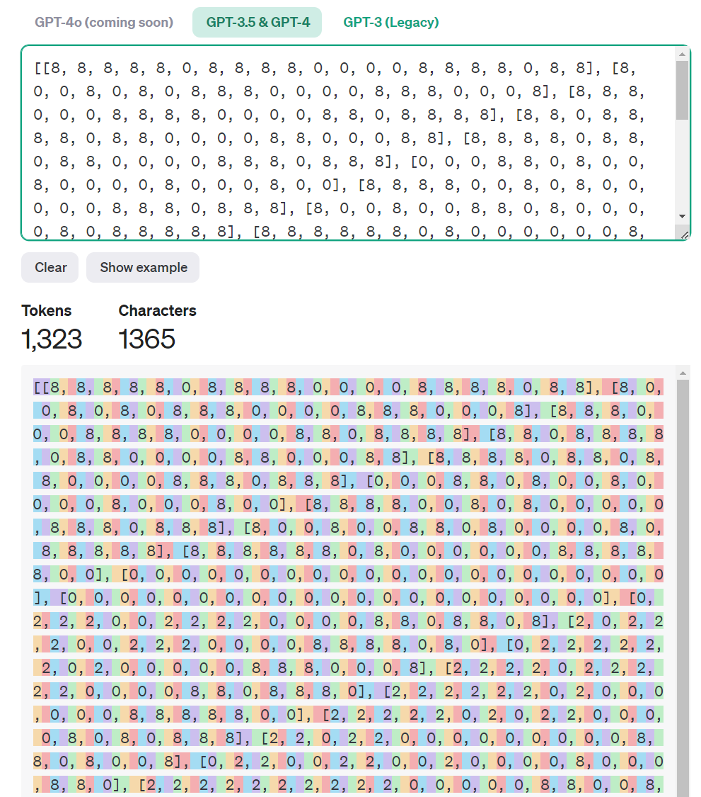

# ARC Challenge and My Approach
Introduction to the ARC Challenge
Artificial General Intelligence (AGI) research has reached an impasse, with current AI models struggling to adapt to new problems or create novel solutions without extensive training. The ARC (Abstraction and Reasoning Corpus) benchmark, introduced by François Chollet in 2019, aims to address this by measuring a system’s ability to acquire new skills and solve open-ended problems. Unlike traditional AI benchmarks that focus on specific skills, ARC evaluates general intelligence, making it a challenging yet crucial test for advancing AGI.

## The ARC Prize
To incentivize progress, the ARC Prize offers over $1,000,000 to anyone who can develop and open-source a solution that beats the ARC-AGI benchmark. This competition, hosted by Mike Knoop (Co-founder of Zapier) and François Chollet (Creator of ARC-AGI and Keras), invites innovators to break the current limitations of AI and contribute to the open-source community.

## My Approach
### Goal
My goal is to create a transformer encoder-decoder capable of natively perceiving and generating data in the domain of integer grids, the format used in the ARC tasks.

### Strategy
#### Custom Tokenization and Embedding:

Existing transformers struggle with ARC tasks due to inadequate grid tokenization. Current tokenizers break grids into arbitrary characters, which is inefficient.

I will develop a simpler tokenizer and embedding space tailored for the integer grids. This approach will avoid the complexity of Vision Transformers' patching and tokenization, focusing instead on a custom solution suitable for the simplicity of ARC grids.
#### Adaptation to New Tasks:

To enable the model to adapt to new tasks, I will integrate additional layers or a few trainable parameters that can be fine-tuned during test time.
By employing a technique known as grokking, which involves fine-tuning on limited new examples, the model will exhibit double-descent behavior, smoothing out learned representations to generalize effectively to new inputs.

## This repository 

This repository will document my journey and progress towards developing a solution for the ARC Challenge. Stay tuned for updates as I implement and refine my approach.

